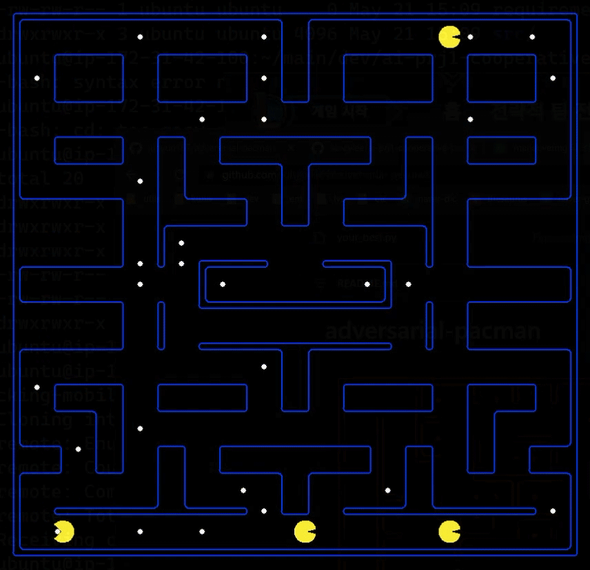

# Agent for Cooperative Pacman Game

ExclusiveAgent, a pacman agent for cooperative pacman game using tree search algorithm.

## Description

### Game Rule

In the given layout, n identical agents should cooperate each other to achieve the best score by eating food pellets.

* The game starts with 100 points
* +10 points for each food pellet eaten
* +500 points for collecting all food pellets
* -.4 points for each action taken
* -1 point for each millisecond used to compute next action

The agents win if they collect all food pellets. If the score reaches under zero or the agents crash, the agents lose.

### Agent Design

#### `ExclusiveAgent`
* Searches and makes its way to the food that has *never* been a target of another agent.
* Properties
    - `self.goal`: Current target food position of the agent. Set to `None` if there is no target.
    - `self.path`: The path to the target food, `self.goal`
    - `self.shared`: An instance of `SharedGameData` class, which is shared among all agents. Contains data about pre-targeted foods
* If `self.path` not empty, the agent follows it recklessly.
* If `self.path` empty, it implies the agent has never found any food, or has just eaten the target food.
    - Removes the current goal from the pre-targeted foods
    - Sets food count only at the very first action of the game
    - Defines search problem by `ExclusionSearchProblem`, which excludes pre-targeted foods from the goal state
    - Gets new target goal and the path to it. `getGoalAndPath` methods returns no goal and stop actions if no foods left except for the pre-targeted foods. Else, finds the goal and the path to it by breadth-first search.
    - Adds the new goal to the pre-targeted foods, then returns next action

#### `SharedGameData`
* Mainly manages the data about pre-targeted foods.
* Properties
    - `self.nextIdx`: Index of the agent that is expected to accept the instance into the agent next; Only for autograder fix
    - `self.remainingFoodsCount`: \# of remaining foods that has never been targeted by any agent
    - `self.pretargetedFoods`: List of positions of pre-targeted foods
* Methods
    - `resetForNewGame`: Should be called every time the agent is initialized. Resets the properties if the next index and the new index mismatches. Only for autograder fix
    - `addFood`, `removeFood`, `getFoods`, `isFoodExist`: Wrapper methods for `self.pretargetedFoods`
    - `setFoodCount`: Sets `self.remainingFoodCounts` only at the very first action of the game. If already set, then does nothing for computation reduction.

## Execution

Installation of the packages
```sh
$ pip install -r requirements.txt
```

Execution for a specific layout
```sh
$ cd src
$ python pacman.py --layout {layout_filename} --agent ExclusiveAgent
```

## Results and Analysis



The image above is a game played by `ExclusiveAgent` on layout test71.

The test was done by exploiting `ClosestDotAgent`, a baseline, and `ExclusiveAgent` 5 times for every layout provided in src/layouts.

|Layout|`ClosestDot`|`Exclusive`|Diff.   |Layout|`ClosestDot`|`Exclusive`|Diff.   |
|:----:|-----------:|----------:|-------:|:----:|-----------:|----------:|-------:|
|test1 |     909.86 |   1038.02 | 128.16 |test37|       0.00 |    857.84 | 857.84 |
|test2 |    1420.61 |   1605.17 | 184.56 |test38|    1236.14 |   1503.08 | 266.94 |
|test3 |    1946.72 |   2199.89 | 253.17 |test39|    1907.32 |   2040.50 | 133.18 |
|test4 |     709.70 |    943.54 | 233.84 |test40|       0.00 |    738.47 | 738.47 |
|test5 |    1398.91 |   1539.14 | 140.23 |test41|    1280.82 |   1460.79 | 179.98 |
|test6 |    1787.35 |   2141.43 | 354.08 |test42|    1480.69 |   1839.33 | 358.64 |
|test7 |     634.49 |    969.09 | 334.60 |test43|       0.00 |    709.56 | 709.56 |
|test8 |    1138.81 |   1564.42 | 425.60 |test44|       0.00 |   1385.14 |1385.14 |
|test9 |    2004.74 |   2155.29 | 150.55 |test45|    1928.55 |   2071.09 | 142.54 |
|test10|       0.00 |    851.35 | 851.35 |test46|     678.43 |    733.59 |  55.16 |
|test11|    1170.11 |   1489.97 | 319.86 |test47|     687.36 |    728.98 |  41.62 |
|test12|    1091.90 |   1959.38 | 867.48 |test48|     860.60 |    926.22 |  65.62 |
|test13|       0.00 |    821.27 | 821.27 |test50|       0.00 |    691.00 | 691.00 |
|test14|     371.85 |   1337.93 | 966.07 |test51|     867.52 |    907.80 |  40.28 |
|test15|    1515.51 |   1967.39 | 451.88 |test52|       0.00 |    581.81 | 581.81 |
|test16|       0.00 |    884.91 | 884.91 |test53|     688.83 |    719.39 |  30.57 |
|test17|     959.69 |   1423.62 | 463.93 |test54|     875.17 |    898.60 |  23.43 |
|test18|    1658.40 |   2094.96 | 436.56 |test55|     589.87 |    692.80 | 102.93 |
|test19|       0.00 |    591.17 | 591.17 |test56|     652.72 |    713.39 |  60.67 |
|test20|       0.00 |   1228.70 |1228.70 |test57|     684.21 |    901.14 | 216.93 |
|test21|       0.00 |   1799.00 |1799.00 |test58|       0.00 |    561.46 | 561.46 |
|test22|       0.00 |    675.26 | 675.26 |test59|     546.79 |    703.77 | 156.98 |
|test23|     699.43 |   1171.81 | 472.38 |test60|     867.38 |   1052.38 | 185.01 |
|test24|    1347.46 |   1795.75 | 448.29 |test61|       0.00 |    541.65 | 541.65 |
|test25|       0.00 |    611.45 | 611.45 |test62|     822.67 |   1067.38 | 244.71 |
|test26|       0.00 |   1134.55 |1134.55 |test63|    1444.39 |   1697.93 | 253.54 |
|test27|    1085.94 |   1718.36 | 632.42 |test64|     536.02 |    595.40 |  59.38 |
|test28|       0.00 |    667.04 | 667.04 |test65|     486.75 |    951.16 | 464.42 |
|test29|     497.91 |   1199.68 | 701.77 |test66|    1156.86 |   1635.44 | 478.57 |
|test30|    1319.81 |   1774.09 | 454.28 |test67|     803.65 |    866.20 |  62.55 |
|test31|       0.00 |    655.99 | 655.99 |test68|     768.09 |    799.85 |  31.76 |
|test32|     798.69 |   1177.02 | 378.33 |test69|     928.85 |   1048.23 | 119.39 |
|test33|    1381.80 |   1782.08 | 400.28 |test70|     890.10 |    921.17 |  31.08 |
|test34|       0.00 |    645.53 | 645.53 |test71|     729.16 |    766.74 |  37.59 |
|test35|       0.00 |   1232.42 |1232.42 |test72|    1007.17 |    998.17 |  -9.00 |
|test36|    1354.45 |   1814.59 | 460.15 |      |            |           |        |

* `ExclusiveAgent` showed 100.0% of win rate during the test, while `ClosestDotAgent` showed 69.3%.
* `ExclusiveAgent` outperformed on every layout except for test72 layout compared to `ClosestDotAgent`.
* Average score of `ExclusiveAgent` was 441.7 points higher than that of `ClosestDotAgent`. (`ExclusiveAgent`: 1182.7, `ClosestDotAgent`: 741.0)

## Possible Future Improvements

* When the game is close to the end, i.e. there are much less foods left compared to the very first state, it takes many time to compute next goal because of BFS. At this moment, the agent may use DFS to find the next goal and use A* algorithm to find the path to it, or use UCS with a relevant cost function which depends on the \# of pellets left.
* When the game is close to the end, some agents stop since there are no un-pre-targeted foods left. In some cases, the stopped agent may be much closer to the food that has been already targeted by another agent. (See test71 layout example above) The stopped agent may detect closer pre-targeted food and make its way to it.

## License and Disclaimer

* The project was submitted as an assignment in COSE361 Artificial Intelligence course, and is no longer maintained.
* Redistribution of the source code is allowed, however the following consequences are your responsibility.
